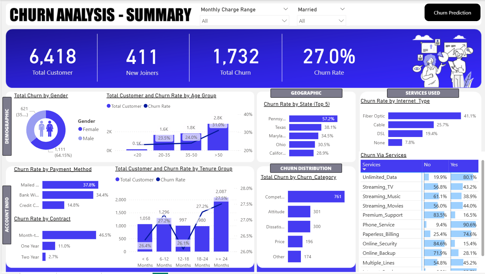
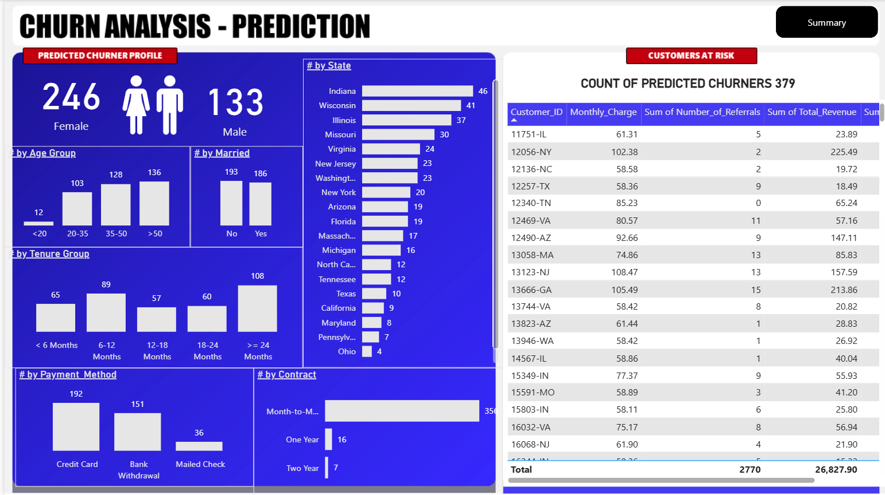

# Customer Churn Prediction & Analysis

## Project Overview
This project focuses on analyzing and predicting telecom customer churn using **machine learning (Python)** and **business intelligence (Power BI)**.  
The goal is to identify customers at risk of leaving, understand churn drivers, and provide actionable insights to reduce churn.

- **Dataset:** Adapted from Indian telecom data, customized to reflect U.S. states and demographics.
- **Tools:** Python (scikit-learn, pandas, matplotlib), Power BI
- **Deliverables:** 
  - ML Model (`Churn_Prediction.ipynb`)
  - Power BI Dashboard (`Churn Analysis.pbix`)
  - Business Insights (README + narrative)

---
## Dashboard Screenshots

### Summary Dashboard


### Prediction Dashboard


## Machine Learning Model
The predictive model was built with a **Random Forest Classifier**.

**Results:**
- **Accuracy:** 85%  
- **Precision (Churners):** 83%  
- **Recall (Churners):** 64%  
- **F1-score (Churners):** 0.73  

These results show the model is strong at correctly predicting churners (precision), but there’s room to improve recall (capturing more actual churners).  

*Confusion Matrix & Classification Report available in the notebook.*

---

## Power BI Dashboard
The Power BI dashboard complements the ML model by providing **interactive analysis** of churn by demographics, contracts, services, and geography.

It includes:
- **Churn by Gender, Age, State, Payment Method, and Contract Type**
- **Tenure group comparisons**
- **Churn by services (e.g., Internet type, add-ons)**
- **Predicted churner profiles with customer IDs**


## Insights & Narrative
Key findings from the dashboard and Power BI AI insights:

- **Age & Tenure**:  
  Customers over 50 had the highest churn volume (2,838), accounting for **44.22% of total churners**.  
  Churn diverged most among customers with **tenure ≥ 24 months**, where churn volume (2,087) was significantly higher.  

- **Gender**:  
  Female churners (1,111) were higher than male churners (621).  

- **Contracts & Payment**:  
  Month-to-month contracts showed the highest churn rate (**46.5%**), while mailed check payments also had higher churn compared to other payment methods.  

- **Internet Services**:  
  Fiber optic users had the highest churn rate (**41.1%**), followed by cable (**25.7%**) and DSL (**19.4%**).  

- **Geography**:  
  Pennsylvania had the highest churn rate (**57.2%**), with Texas and Maryland following.  

---

## Repository Structure
- `Churn_Prediction.ipynb` → ML model (Random Forest) training and evaluation  
- `Churn Analysis.pbix` → Power BI interactive dashboard   
- `README.md` → Project overview and insights  


##  How to Use
1. Clone this repo:  
   ```bash
   git clone https://github.com/YourUsername/Customer_Churn_PowerBI.git
